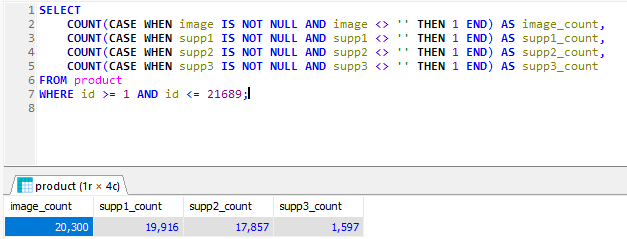

### according to image and query used  total images will be 

```
SELECT
COUNT(CASE WHEN image IS NOT NULL AND image <> '' THEN 1 END) AS image_count,
COUNT(CASE WHEN supp1 IS NOT NULL AND supp1 <> '' THEN 1 END) AS supp1_count,
COUNT(CASE WHEN supp2 IS NOT NULL AND supp2 <> '' THEN 1 END) AS supp2_count,
COUNT(CASE WHEN supp3 IS NOT NULL AND supp3 <> '' THEN 1 END) AS supp3_count
FROM product
WHERE id >= 1 AND id <= 21689;
```

- This query counts all the selected columns which are image, supp1, supp2 and supp3 and counts data fields that have values in columns selected.

### PHP script using CURL

- PHPs built in function called CURL allows the ability to create http requests concurrently, this allows the multiple downloads of images at once.