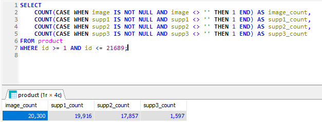
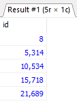
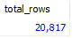

### according to image and query used, total images will be roughly 60000 images



```
SELECT
COUNT(CASE WHEN image IS NOT NULL AND image <> '' THEN 1 END) AS image_count,
COUNT(CASE WHEN supp1 IS NOT NULL AND supp1 <> '' THEN 1 END) AS supp1_count,
COUNT(CASE WHEN supp2 IS NOT NULL AND supp2 <> '' THEN 1 END) AS supp2_count,
COUNT(CASE WHEN supp3 IS NOT NULL AND supp3 <> '' THEN 1 END) AS supp3_count
FROM product
WHERE id >= 1 AND id <= 21689;
```

- This query counts all the selected columns which are image, supp1, supp2 and supp3 and counts data fields that have values in columns selected.

### The downloads are seperated into batches based on query below



```
SELECT id
FROM (
    SELECT
        id,
        ROW_NUMBER() OVER (ORDER BY id ASC) AS item_number
    FROM product
   dummy_database WHERE id >= 1 AND id <= 21689
    ORDER BY id ASC
) AS numbered_products
WHERE item_number = 1 OR item_number = 5000 OR item_number = 10000 OR item_number = 15000 OR item_number = 20817;

```

-ids 8 ==> 5314 done!    
-ids 5315 ==> 10534 done!
-ids 10535 ==> 15854 done!
-ids 15855 ==> 21689 done!

# '$' ranges from 0 - 104

-updated table product with image paths products/web$/img

# total number of folder for jpg and webp should be 104

-using query below we can achieve total number of items
```
SELECT COUNT(*) AS total_rows
FROM product;
```


### PHP script using CURL

- PHPs built in function called CURL allows the ability to create http requests concurrently, this allows the multiple downloads of images at once.
